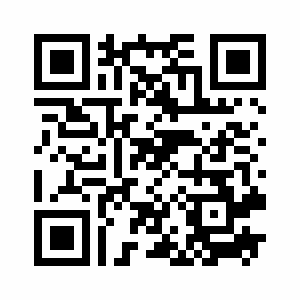

<!-- $theme: default -->

Desenvolvimento Aberto
===

# 

##### Apresentação da Disciplina + Ciclo de vida de um Bug

###### Igor dos Santos Montagner ( [igorsm1@insper.edu.br](mailto:igorsm1@insper.edu.br) )

---

# Burocracias 

### Horários de aula:

* Segunda 15:45-17:45
* Quarta 15:45-17:45

### Atendimento:

* Segunda 18:00 - 19:30

----------

# Motivação

Nas disciplinas anteriores trabalhamos 

- criando um projeto novo.
- que normalmente morre após a disciplina
- e nunca é usado por ninguém

#

No mercado, normalmente trabalhamos em um projeto existente

- corrigindo problemas
- realizando melhorias
- que é usado por vários usuários

---

# Objetivos de Aprendizagem

Ao final da disciplina o estudante será capaz de:

- Analisar uma base de códigos desconhecida de médio/grande porte e modificá-la de modo a fazer melhorias e corrigir falhas em um software;
- Interagir com uma equipe remota de desenvolvedores para entregar código que atenda aos padrões de qualidade e estilo de código de um projeto;
- Entender as diferenças licenças de software livre e como elas impactam na distribuição e reutilização de uma base de código.

---

# Objetivos (versão resumida)

Ao final da disciplina o estudante será capaz de:

- Baixar, entender e **modificar** o código de um projeto
- Conseguir que suas modificações sejam **incorporadas**
- Entender como licenças impactam a **distribuição** de software.

----

# Programa do curso

1. Modelos de desenvolvimento e comercialização de software;
2. Licenças de software e seu impacto na reutilização e distribuição;
3. Ferramentas de apoio ao desenvolvimento colaborativo de software (livre ou proprietário);
4. Documentação de software e de código;
5. Tradução e internacionalização de Software
6. Sistemas de compilação e distribuição de código fonte;
7. Aspectos humanos e comunitários em desenvolvimento de software;
8. Estudo de casos de sucesso.

---

# Materiais do curso 

Github: [https://github.com/igordsm/dev-aberto](https://github.com/igordsm/dev-aberto)

Site: [https://igordsm.github.io/dev-aberto/](https://igordsm.github.io/dev-aberto/)

Blackboard será usado para avisos somente. Todo conteúdo estará disponível no github.

----------

# Expectativas

**Atividade**: 15 minutos

#

#

### Quais são suas expectativas em relação ao curso?

---

# Apresentação do curso

**Proposta**: Curso será *gamificado*

- Cada aluno criará um *avatar* na disciplina ([meu avatar](https://igordsm.github.io/dev-aberto/players.html#igordsm))
- Contribuições a projetos geram XP
- Ao cumprir alguns objetivos você ganha uma *skill* ([todas skills](https://igordsm.github.io/dev-aberto/skills.html))

#

**Primeiro bug**: skill obtida ao enviar o primeiro Pull Request para um projeto.

---

# Apresentação do curso

*Skills* tem 3 tipos:

- Código: Pull Requests enviados a projetos;

##

- Tradução e documentação: melhorias em documentação de projetos e traduções de/para português;

##

- Comunidade: Stackoverflow, participação em Issues no Github, lista de emails, meetups na vida real, etc.

##

É necessário obter skills das 3 áreas para passar.

---

# Apresentação do curso

**Proposta**: Curso será *gamificado*

- Seu avatar sobe de nível se obtiver XP e skills suficientes

	- Ghost (I)
	- Newbie (D)
	- Iniciado (C)
	- Competente (B)
	- Mestre (A)
	- Grão Mestre (A+)

Veja a página [Regras](https://igordsm.github.io/dev-aberto/regras.html) para os requisitos de cada nível.

---

# Apresentação do curso 

Disciplina baseada em projetos

- Agosto/Setembro: **Tutorial** 
	- 30-60 minutos de expositiva/discussões
    - Pequenos projetos focados em um tema específico
- Outubro/Novembro: Projeto
	- 4 sprints de 2 semanas
	- **Autonomia** para definir quais tarefas serão feitas
	- Será permitido escolher o projeto que vocês quiserem

----------

# Discussão

Suponha que você decidiu liberar um projeto que apresentou que você desenvolveu nos últimos semestres. Um usuário de seu software teve um problema e te contactou pedindo ajuda. 

#

- Quais serviços você precisaria ter para comunicar este relato à equipe de desenvolvimento?
- Como você estruturaria esse processo de feedback de usuário?
- Como você implantaria a correção?

---

# Arquitetura ao redor do código

#

Uma série de serviços e processos acompanha um software.

---

# Ciclo de vida de um bug

1. New
2. Assigned
3. Accepted (in progress)
4. Closed
	- Fixed
	- Won't fix
	- Duplicate
	- Invalid

---

# Ciclo de vida de um bug

#

**Atividade**: O roteiro da aula de hoje simula o processo de resolução de uma issue em um projeto.

#

1. Existe uma issue para cada aluno no github do projeto
2. Vocês deverão criar um avatar no site da disciplina e adicionar a ele a *skill* **Penso logo existo**. 
3. Vocês então devem enviar um PR para o projeto original. 
