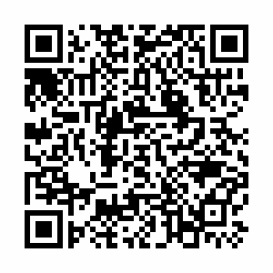
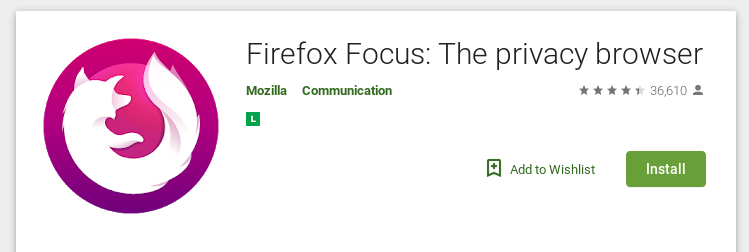
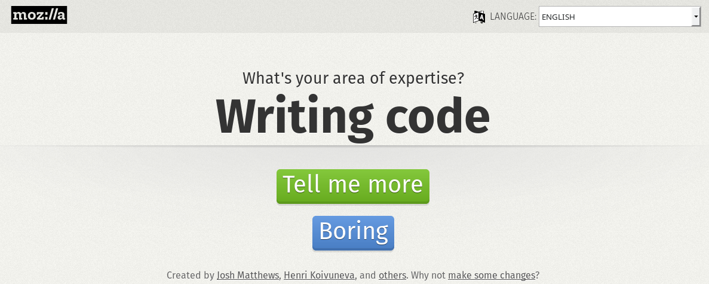
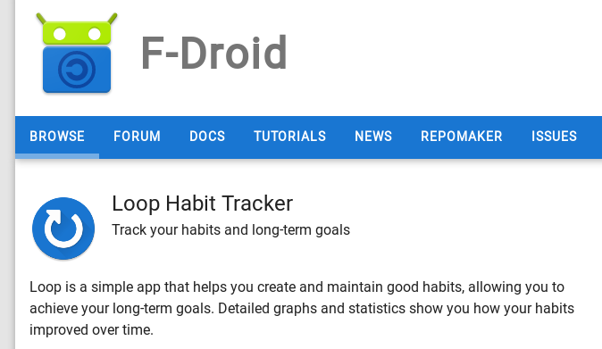

<!-- $theme: default -->

Desenvolvimento Aberto
===

# 

##### Em direção a sua primeira contribuição

###### Igor dos Santos Montagner ( [igorsm1@insper.edu.br](mailto:igorsm1@insper.edu.br) )

---

# Aulas passadas

### Discussões

* Serviços e software de auxílio a projeto de software
* Comunidades de usuários e desenvolvedores

### Atividades

* Criação de avatar da disciplina
* Texto colaborativo sobre a comunidade ao redor de alguns softwares.

---

# Hoje

### Discussões

* Recepção de novos contribuintes em projetos
* Fluxo de trabalho: modelo de Pull Request

### Atividades

* Escolha e apresentação de projetos para primeira contribuição

---

# Recepção de novos desenvolvedores

Ler as seções

1. *Abstract*, *Introduction*, *Reception Issues*, *Newcomers' Communication Behavior* e Figura 2 do artigo "Social Barriers Faced by Newcomers Placing Their First Contribution in Open Source Software Projects"

##

2. *Abstract*, *Introduction*, *Discussion* e *Implications* do artigo "Almost There: A Study on Quasi-Contributors in Open Source Software Projects"

---
# Quiz

[https://goo.gl/forms/hpnvNnSRTQYhjz8z2](https://goo.gl/forms/hpnvNnSRTQYhjz8z2)

---
# Discussão sobre os artigos

---
# Discussão sobre os artigos

Exemplos

1. [PR abandonado pelo proponente](https://github.com/iSoron/uhabits/pull/349)
2. [Repositório sem manutenção](https://github.com/yhatt/marp)
3. [Comunicação estranha](https://github.com/iSoron/uhabits/issues/209)
4. Projeto abandonado?[[1]](https://dev.haiku-os.org/ticket/6829) [[2]](https://dev.haiku-os.org/ticket/605)

---
# Fluxo de trabalho

<small> Revisão </small>

---

<small> 
  Fonte: https://www.slideshare.net/abderrahmanebenbachir/continuous-integration-in-github 
</small>

---

<small> 
  Fonte: https://www.slideshare.net/abderrahmanebenbachir/continuous-integration-in-github 
</small>

---
# Fluxo de Trabalho: outros modelos

1. Enviar patch via lista de e-mails (ex. Linux)
2. Ferramentas de *code review* (ex. KDE - Phabricator)
3. Patch é anexado no Bug Tracker (ex. Haiku, KDE)
4. Não recebe contribuições externas

---
# Atividade

1. Escolher um projeto para sua primeira contribuição
2. Baixar o código e pesquisar:
	- Quais tecnologias você precisará aprender
	- Onde obter ajuda
	- Como compilar / Documentação de desenvolvimento
3. Escolher uma issue que pareça simples
4. Apresentar um resumo disso para a turma no fim da aula.

##### Teremos pelo menos 1 hora de estúdio nas próximas duas aulas para fazer nossa primeira contribuição.

---
# Sugestões de primeiros projetos

A própria disciplina ([1 issue para cada aluno](https://github.com/igordsm/dev-aberto/issues)) 

* **Vantagens**: facilidade em obter ajudar. evita a maioria das barreiras sociais
* **Desvantagens**: projeto muito pequeno e código bastante simples. provavelmente será finalizado antes de 2 aulas.

--- 
# Sugestões de primeiros projetos

Firefox Focus - Browser com modo privativo para Android

* **Vantagens**: Aceita PR pelo Github, marca Issues como "Good First Issue"
* **Desvantagens**: código pode ser complexo

---
# Sugestões de primeiros projetos

[What can I do for Mozilla](https://whatcanidoformozilla.org/)

* **Vantagens**: projetos organizados, comunidade responsiva, marca issues como "Easy" ou "Good First Issue"
* **Desvantagens**: pode ser um pouco complexo para começar...

---
# Sugestões de primeiros projetos

[Habits Tracker](https://github.com/iSoron/uhabits/issues)

* **Vantagens**: projeto não é tão complexo, labels *Small task* e *Small enhancement*.
* **Desvantagens**: projeto só tem um mantenedor

---
# Outras possibilidades

1. KDE -  Junior jobs
2. Falkon browser
3. LXQt
4. Termux
5. Spyder

---
# Atividade

1. Escolher um projeto para sua primeira contribuição
2. Baixar o código e pesquisar:
	- Quais tecnologias você precisará aprender
	- Onde obter ajuda
	- Como compilar / Documentação de desenvolvimento
3. Escolher uma issue que pareça simples
4. Apresentar um resumo disso para a turma no fim da aula.

##### Teremos pelo menos 1 hora de estúdio nas próximas duas aulas para fazer nossa primeira contribuição.

---
# Próxima aula

**Tarefa**: Leitura até o Capítulo 4 do Livro "Debugging: 9 indispensible rules...." - approx. 27 páginas de leitura leve. 

---

# 

##### Em direção a sua primeira contribuição

